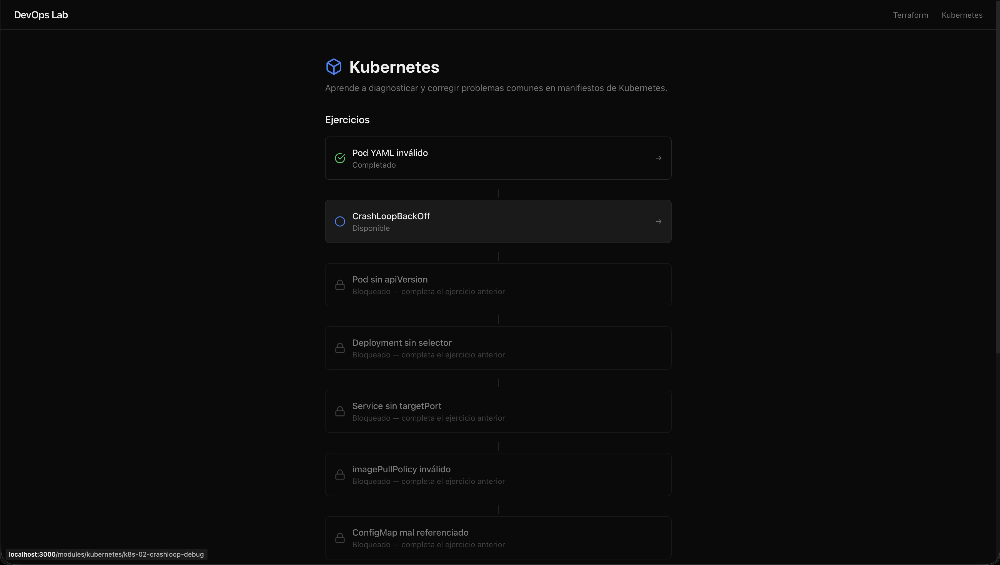
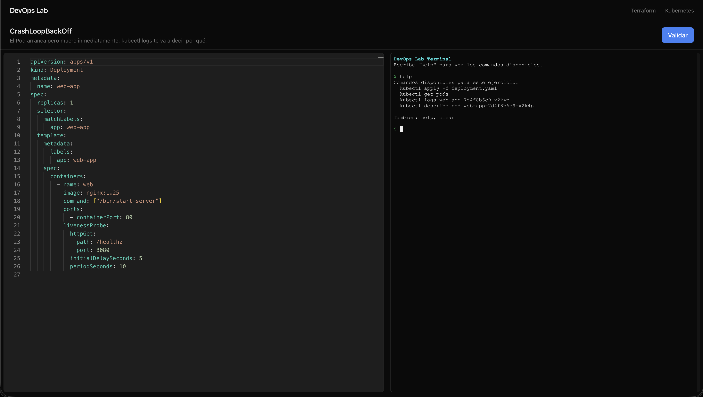
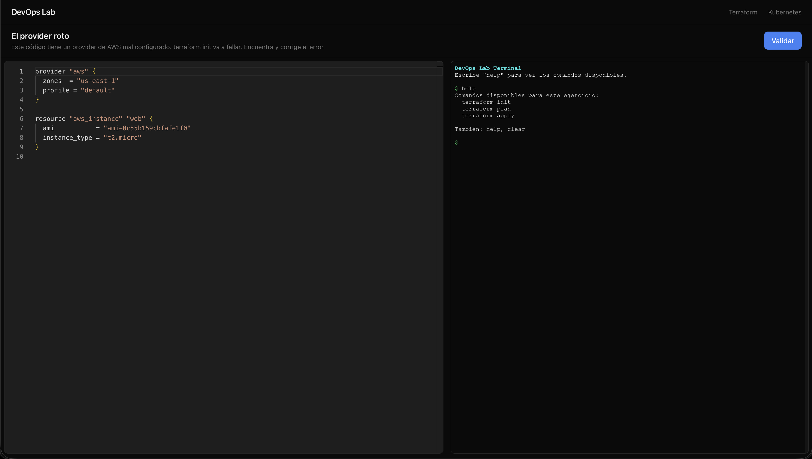

# DevOps Learning Platform

Interactive learning platform for DevOps technologies. Learn by fixing broken code, not by reading docs.

## Overview

### Platform Screenshots

<table>
<tr>
<td><strong>Home</strong></td>
<td><strong>Progress tracking</strong></td>
</tr>
<tr>
<td></td>
<td></td>
</tr>
<tr>
<td><strong>Kubernetes exercise</strong></td>
<td><strong>Terraform exercise</strong></td>
</tr>
<tr>
<td></td>
<td></td>
</tr>
</table>

## Features

- **Interactive exercises** with a code editor (Monaco), simulated terminal (xterm.js), and instant feedback
- **Multiple modules**: Terraform, Kubernetes, Ansible (extensible via admin panel or YAML)
- **Database-backed exercises**: stored in SQLite, managed via admin panel or YAML import
- **Authentication**: local accounts, OAuth (Google/GitHub/Azure), TOTP 2FA, WebAuthn passkeys
- **Admin panel**: manage users, exercises, modules, and audit logs
- **Dark/light theme** with automatic OS preference detection
- **i18n**: Spanish (default) and English, extensible to other languages
- **Realistic simulation**: terminal commands produce output identical to real CLI tools
- **Semantic versioning**: automated releases via semantic-release

## Tech Stack

- Next.js 15 (App Router) + TypeScript
- Tailwind CSS 4
- SQLite via Drizzle ORM + better-sqlite3
- iron-session + argon2 (auth)
- Monaco Editor (`@monaco-editor/react`)
- xterm.js (`@xterm/xterm`)

## Prerequisites

- Node.js 18+
- npm

## Local Development

```bash
# Install dependencies
npm install

# Create the SQLite database and default admin user
npm run db:seed

# Import exercises from YAML into the database
npm run exercises:import

# Start the development server
npm run dev
```

Open [http://localhost:3000](http://localhost:3000).

Default admin credentials: `admin@devopslab.local` / `admin1234` (configurable via `ADMIN_EMAIL` / `ADMIN_PASSWORD` env vars).

## Available Scripts

| Command | Description |
|---|---|
| `npm run dev` | Start development server (port 3000) |
| `npm run build` | Production build |
| `npm run start` | Start production server |
| `npm run lint` | Run ESLint |
| `npm run db:seed` | Create/reset database tables + default admin user |
| `npm run exercises:import` | Import YAML exercises into database |

## Production Deployment

### Option 1: Node.js Server

```bash
# Install dependencies
npm ci

# Create the database and import exercises
mkdir -p data
npm run db:seed
npm run exercises:import

# Build the application
npm run build

# Start the production server
npm run start
```

The app runs on port 3000 by default. Set `PORT` environment variable to change it.

## Docker

Production-ready Docker setup with multi-stage build, health checks, and persistent SQLite database.

### Quick Start

```bash
# Build and run in background
docker-compose up -d --build

# View logs
docker-compose logs -f

# Stop the application
docker-compose down

# Stop and remove volumes (WARNING: deletes all data)
docker-compose down -v
```

App URL: `http://localhost:3000` (or `http://<your-host>:3000` if on a remote server).

### Docker CLI

```bash
# Build the image
docker build -t learning-platform:latest .

# Run the container with persistent database
docker run -d \
  -p 3000:3000 \
  -v learning-platform-data:/app/data \
  --name learning-platform \
  learning-platform:latest

# View logs
docker logs -f learning-platform

# Stop and remove
docker stop learning-platform
docker rm learning-platform
```

### Configuration: Host and Port

Control the listening address and port via environment variables in `docker-compose.yml`:

```bash
# Use default (0.0.0.0:3000 - all interfaces)
docker-compose up -d --build

# Use specific port
PORT=8080 docker-compose up -d --build

# Use specific host and port
HOST=192.168.1.100 PORT=8080 docker-compose up -d --build
```

The container listens on all interfaces (`0.0.0.0`) by default. Environment variables:

- `HOST` — host interface (default `0.0.0.0`)
- `PORT` — port number (default `3000`)
- `NODE_ENV=production` — hard-coded in production builds

### Architecture

**Multi-stage Docker build** (3 stages):

1. **builder**: Installs build deps, compiles Next.js app, compiles `better-sqlite3` (~500MB, discarded)
2. **db-init**: Preserves database schema and dependencies (~200MB, discarded)
3. **runner**: Minimal Alpine base with production artifacts only (~350MB, final image)

**Key features:**

- Non-root user (`nextjs:1001`) for security
- `dumb-init` for proper signal handling (SIGTERM/SIGINT)
- `scripts/seed.js` initializes SQLite schema on container startup
- SQLite WAL mode for better concurrency
- Health check runs every 30 seconds

### Database Management

**Location in container:** `/app/data/learning-platform.db`

**Backup / restore:**

```bash
# Backup the database
docker cp learning-platform:/app/data/learning-platform.db ./backup.db

# Restore the database
docker cp ./backup.db learning-platform:/app/data/learning-platform.db
docker restart learning-platform
```

**Reset database (destructive):**

```bash
docker-compose down -v
docker-compose up -d --build
```

### Troubleshooting

**Container won't start:**

```bash
# Check logs
docker-compose logs --tail=100 learning-platform

# If database is locked or corrupted, remove the volume
docker-compose down
docker volume rm learning-platform_learning-platform-data
docker-compose up -d --build
```

**Inspect database:**

```bash
docker cp $(docker-compose ps -q learning-platform):/app/data/learning-platform.db ./backup.db
sqlite3 backup.db ".schema"
```

**Permission errors:**

```bash
docker exec -it learning-platform sh
chown -R nextjs:nodejs /app/data
```

## Documentation

| Document | Description |
|----------|-------------|
| [docs/exercises.md](docs/exercises.md) | How to add exercises (YAML, admin panel, API, direct DB) |
| [docs/database.md](docs/database.md) | Database management, switching to PostgreSQL/MySQL/Turso |
| [docs/configuration.md](docs/configuration.md) | All environment variables, config files, key source files |
| [CONTRIBUTING.md](CONTRIBUTING.md) | Full contributing guide (YAML format, Check DSL, i18n, terminal commands) |

## Project Structure

```
src/
  app/              Next.js App Router (pages + API routes)
    admin/           Admin panel (users, exercises, modules, audit)
    api/             REST API endpoints
    modules/         Dynamic [module]/[exerciseId] routes
  components/       React components (editor, terminal, lab, auth, admin)
  lib/
    auth/            Authentication (session, password, OAuth, TOTP, passkeys)
    db/              Drizzle ORM schema + connection + seed
    exercises/       Exercise loader (db-loader.ts = runtime Check interpreter)
    i18n/            Internationalization (locales, context provider)
    theme/           Dark/light theme provider
    validators/      Unified validation engine
    terminal/        Terminal command simulator
exercises/          YAML exercise source files + module config
scripts/            Build scripts (import-exercises.ts)
docs/               Documentation
data/               SQLite database file (gitignored)
```

## License

MIT
