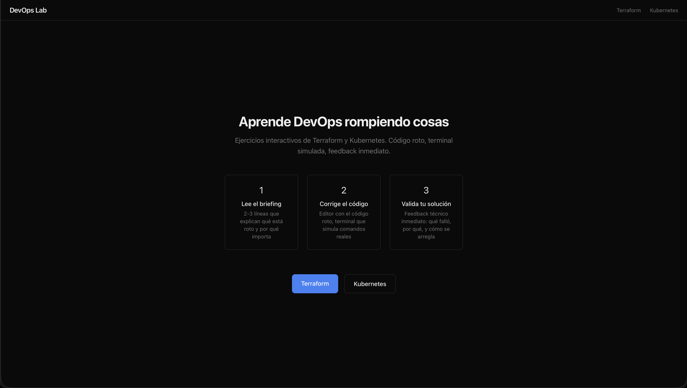
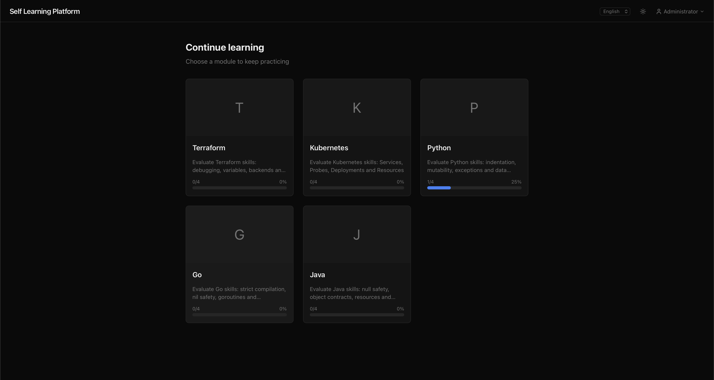
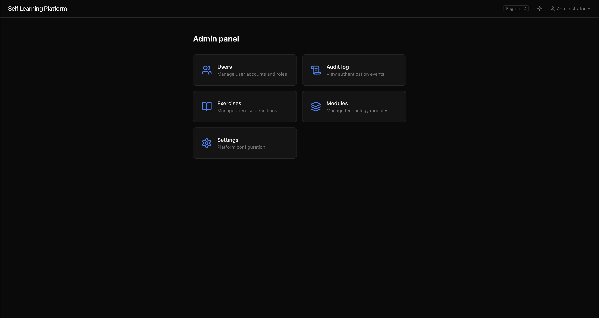
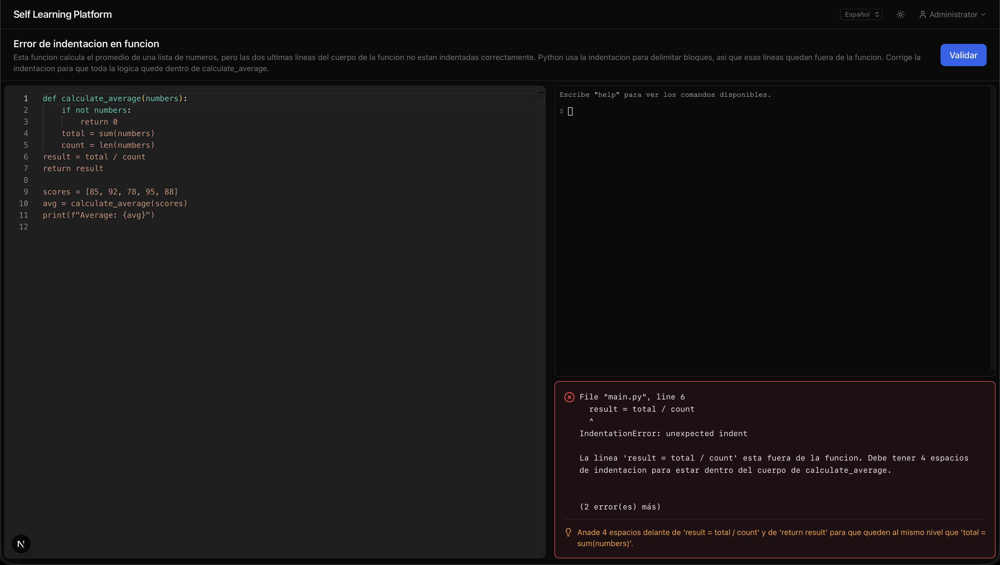

# 🚀 Self Learning Platform

Build real technical capability through structured, hands-on problem solving — without infrastructure setup, external systems, or operational overhead. Designed for teams that measure performance by execution, not theory.

## The Problem

Most technical training fails where it matters:

- 📖 Passive content, low retention
- 🧪 No realistic failure scenarios
- 📊 No measurable skill validation
- 🏗 Training environments that require maintenance
- 🎭 Theoretical knowledge mistaken for real competence

Learning becomes disconnected from execution.

## ⚙️ The Solution

A fully self-contained, self-paced learning environment focused on deliberate practice.

- No external infrastructure.
- No provisioning.
- No billing risks.
- No operational complexity.

Learners debug broken configurations, resolve failure states, and restore working systems in a controlled environment.

They progress by solving — not by watching.

## 🎯 Why It Works

### 🔍 Active Debugging

- Learners fix errors, repair invalid definitions, and resolve system inconsistencies.
- Every exercise simulates real-world failure patterns.
- Progress depends on reasoning.

### ⚡ Instant Validation

Deterministic feedback confirms correctness immediately.

- No guesswork.
- No ambiguity.
- No waiting.

### 🛡 Zero Operational Overhead

- Everything runs in isolation.
- Nothing connects to external systems.
- Deploy once. Train indefinitely.

### 📈 Measurable Capability

- Structured learning paths
- Progress tracking
- Standardized exercises
- Audit visibility

Skill becomes observable and comparable.

## 🏢 Use Cases

### 👥 Team Onboarding

- Standardize technical fundamentals before production access.
- Ensure consistency across every new hire.

### 🧪 Skills Assessment

- Evaluate execution, not memorization.
- Observe real debugging behavior under constraints.

### 📚 Internal Upskilling

- Enable structured progression into advanced technical roles.
- Reduce reliance on constant supervision.

### 🎥 Technical Interviews

- Assign real-world scenarios.
- Observe reasoning in real time.
- Assess capability directly.

## 🖥 Screenshots

<table>
<tr>
<td><strong>🏠 Dashboard</strong></td>
<td><strong>📊 Progress Tracking</strong></td>
</tr>
<tr>
<td></td>
<td></td>
</tr>
<tr>
<td><strong>🛠 Admin panel</strong></td>
<td><strong>✅ Exercise Terminal</strong></td>
</tr>
<tr>
<td></td>
<td></td>
</tr>
</table>

## 🌟 Key Capabilities

- 🖊 Interactive coding environment with embedded editor
- 💻 Simulated terminal for realistic execution flows
- 🧪 Deterministic validation engine with instant feedback
- 🗂 Extensible exercise system with structured content management
- 🔐 Role-based authentication and access control
- 📜 Audit logging and progress tracking
- 🌗 Dark and light interface modes

## 🚀 Quick Start

```bash
# Install dependencies
npm install

# Initialize database and default admin
npm run db:seed

# Import exercises
npm run exercises:import

# Start development server
npm run dev
```

Open:

```
http://localhost:3000
```

Default admin credentials:

```
admin@devopslab.local
admin1234
```

Override using `ADMIN_EMAIL` and `ADMIN_PASSWORD` environment variables.

## 🐳 Container Deployment

Production-ready container with persistent storage support.

```
# Build and run
docker-compose up -d --build

# View logs
docker-compose logs -f

# Stop
docker-compose down
```

Default URL:

```
http://localhost:3000
```

Configure via `HOST` and `PORT` environment variables.

## 💾 Database Backup

```
# Backup
docker cp learning-platform:/app/data/learning-platform.db ./backup.db

# Restore
docker cp ./backup.db learning-platform:/app/data/learning-platform.db
docker restart learning-platform
```

## 📄 Documentation

| Document | Description |
|----------|-------------|
| [docs/api.md](docs/api.md) | API endpoints and usage examples |
| [docs/architecture.md](docs/architecture.md) | System architecture and design decisions |
| [docs/configuration.md](docs/configuration.md) | Environment variables and configuration |
| [docs/database.md](docs/database.md) | Database configuration and migration |
| [docs/exercises.md](docs/exercises.md) | Creating and importing exercises |
| [docs/demo.md](docs/demo.md) | Demo instructions and sample exercises |
| [docs/development.md](docs/development.md) | Development setup and contribution guidelines |
| [docs/production.md](docs/production.md) | Deploying to production environments |
| [CONTRIBUTING.md](CONTRIBUTING.md) | Contribution guidelines |

## License

MIT
