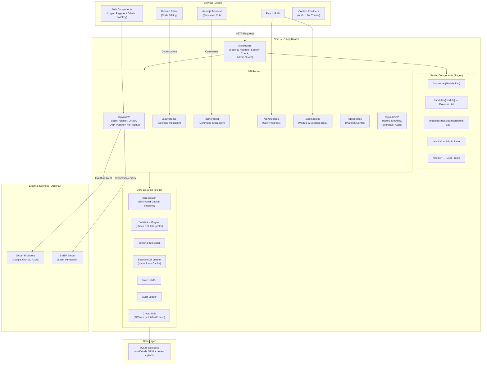
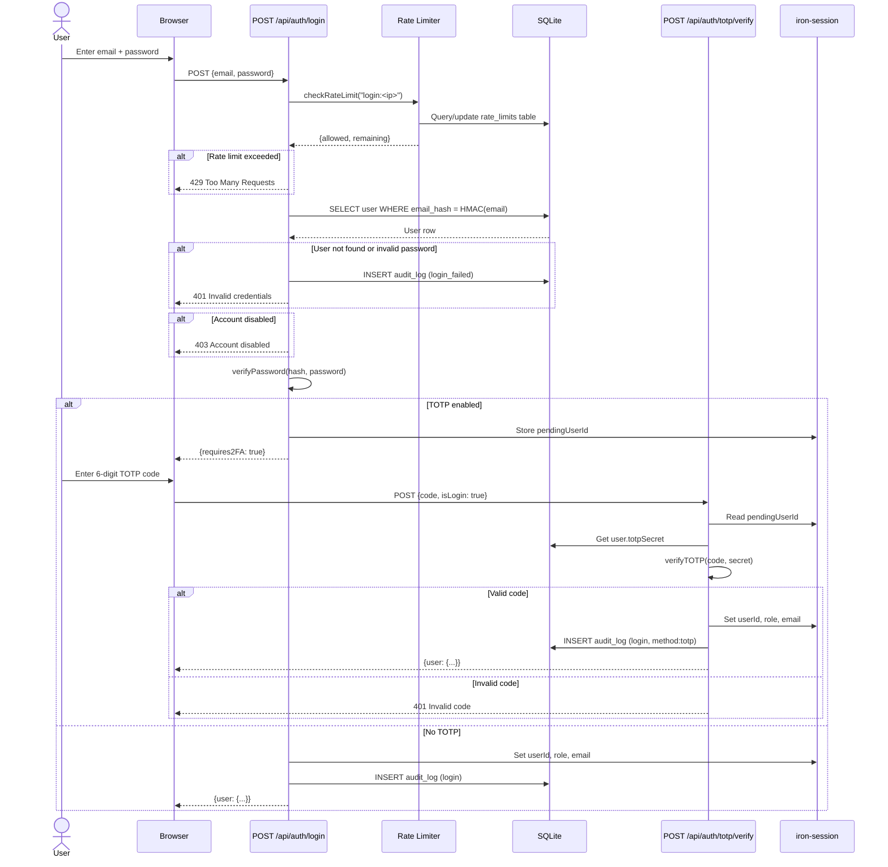
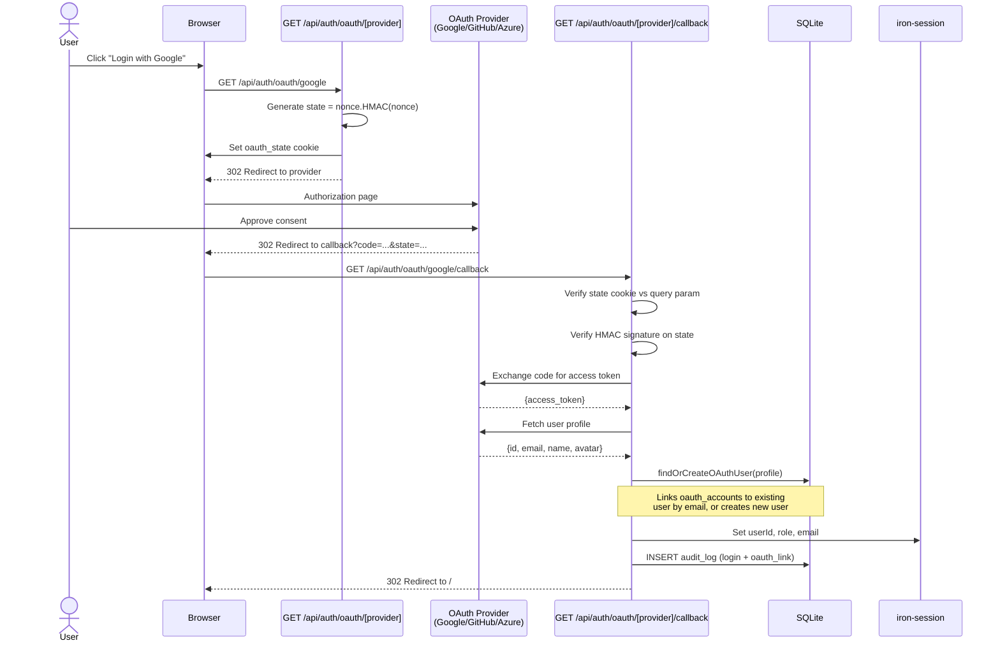
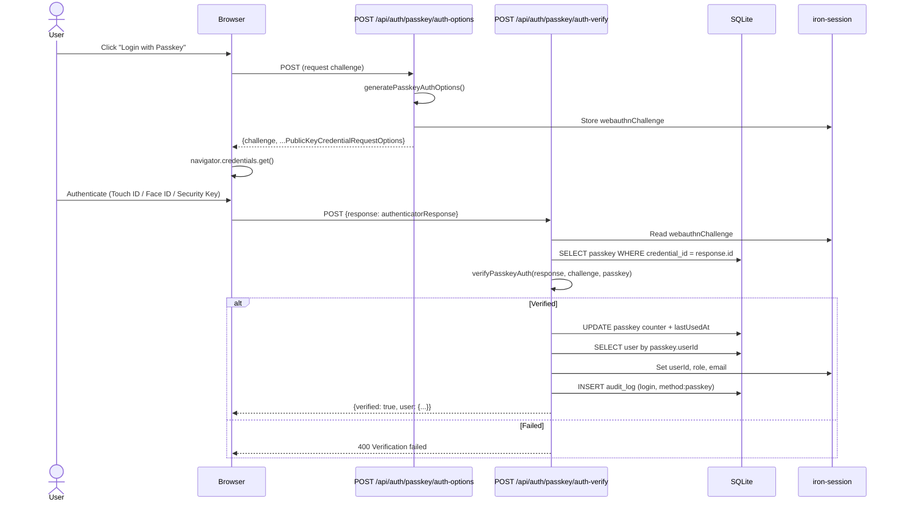
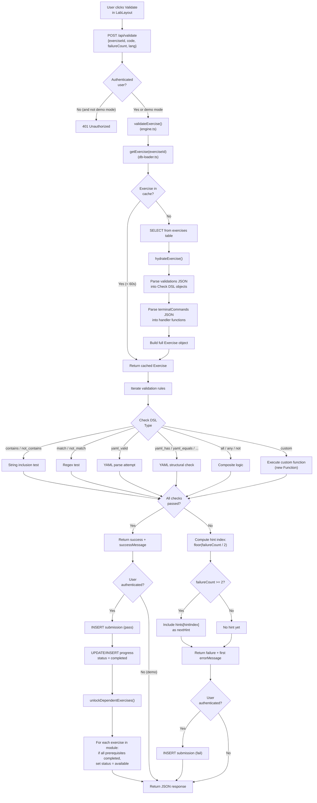
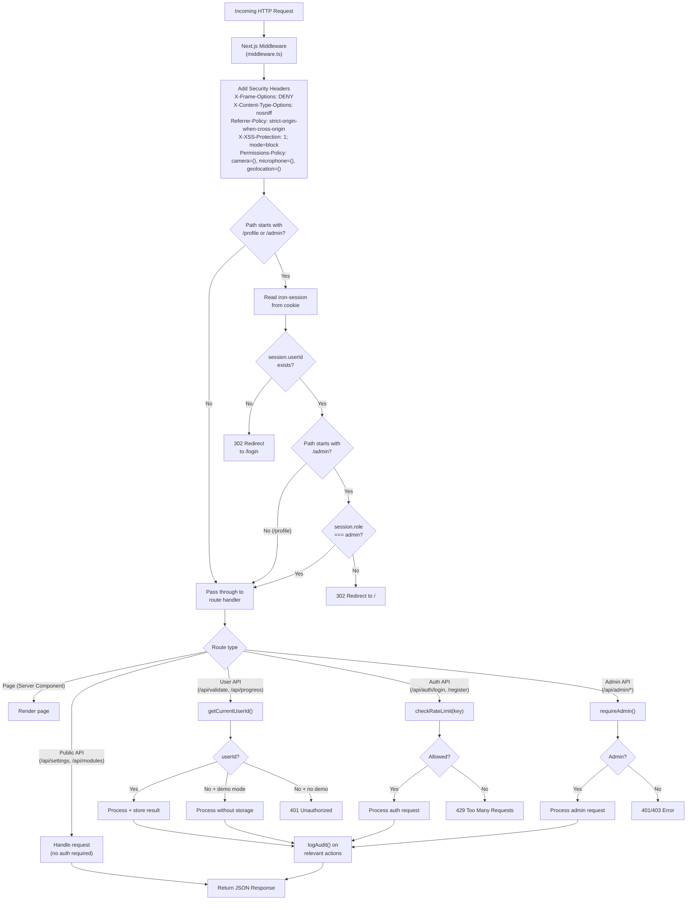
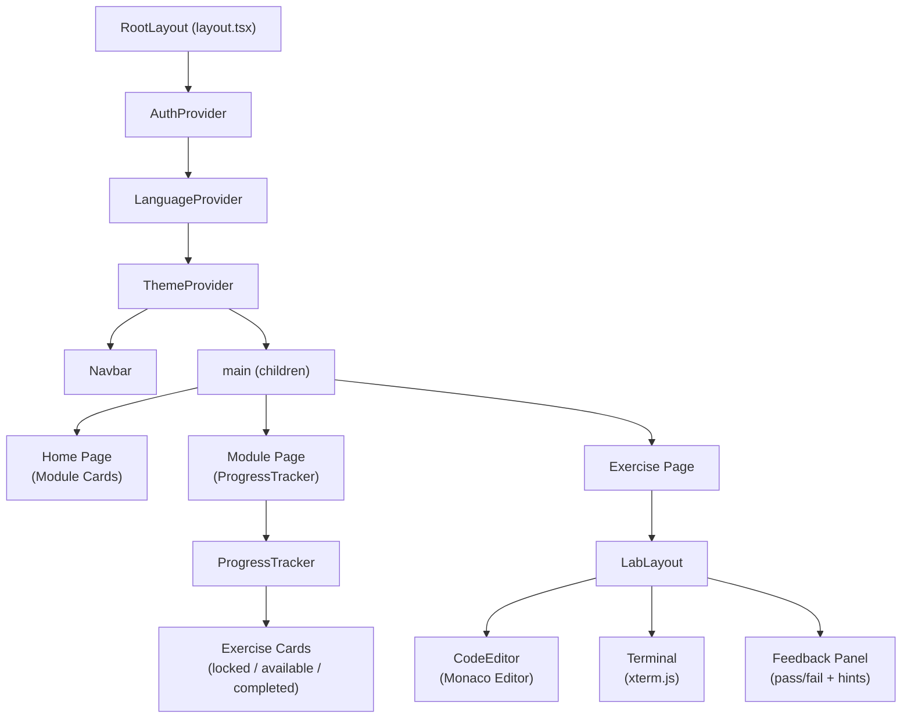

# Architecture

This document describes the system architecture of the Self Learning Platform using Mermaid diagrams.

## 1. System Architecture Overview

The platform is a Next.js 15 monolith using the App Router. The server handles both page rendering (Server Components) and API routes. The client-side embeds Monaco Editor for code editing and xterm.js for an interactive terminal. Authentication is managed with iron-session (encrypted cookies), and all data is stored in a single SQLite database accessed via Drizzle ORM.

## 2. Database Schema (Entity Relationship)

The database is a single SQLite file managed by Drizzle ORM. The `users` table is the central entity, linked to authentication methods (OAuth accounts, passkeys), learning data (progress, submissions), and audit records. Exercises are organized into modules, and both are stored declaratively as JSON in the database.

```mermaid
erDiagram
    users {
        text id PK "UUID"
        text email "AES-encrypted"
        text email_hash UK "HMAC for lookup"
        text password_hash "argon2 hash"
        text username "default: anonymous"
        text display_name "AES-encrypted"
        text role "admin | user | anonymous"
        text totp_secret "TOTP shared secret"
        boolean totp_enabled "2FA toggle"
        boolean email_verified
        boolean disabled
        text avatar_url
        text preferences "JSON"
        text created_at
        text updated_at
    }

    oauth_accounts {
        integer id PK "autoincrement"
        text user_id FK
        text provider "google | github | azure"
        text provider_account_id
        text access_token
        text refresh_token
        text created_at
    }

    passkeys {
        integer id PK "autoincrement"
        text user_id FK
        text credential_id UK "WebAuthn credential"
        text public_key
        integer counter
        text device_type
        boolean backed_up
        text transports "JSON array"
        text name
        text created_at
        text last_used_at
    }

    modules {
        text id PK "e.g. terraform, kubernetes"
        text title
        text description "JSON per-language"
        text icon "Lucide icon name"
        text prefix "e.g. tf, k8s"
        text language "e.g. hcl, yaml"
        boolean show_difficulty
        text image
        integer sort_order
        text created_at
    }

    exercises {
        text id PK "e.g. tf-01-broken-provider"
        text module_id FK
        text title
        text briefing
        text language
        text initial_code
        text prerequisites "JSON array of exercise IDs"
        text hints "JSON array"
        text success_message
        text validations "JSON array of Check DSL"
        text terminal_commands "JSON object"
        text i18n "JSON per-language overrides"
        text difficulty "easy | medium | hard"
        integer sort_order
        text created_at
        text updated_at
    }

    progress {
        integer id PK "autoincrement"
        text user_id FK
        text exercise_id
        text status "locked | available | completed"
        text completed_at
    }

    submissions {
        integer id PK "autoincrement"
        text user_id FK
        text exercise_id
        text code
        text result "pass | fail"
        text feedback
        text submitted_at
    }

    settings {
        text key PK
        text value
        text updated_at
    }

    rate_limits {
        integer id PK "autoincrement"
        text key "e.g. login:192.168.1.1"
        integer attempts
        text window_start
    }

    audit_log {
        integer id PK "autoincrement"
        text user_id
        text action "login, register, totp_enable, ..."
        text ip
        text user_agent
        text details "JSON"
        text created_at
    }

    email_verification_tokens {
        integer id PK "autoincrement"
        text user_id FK
        text token UK
        text expires_at
        text created_at
    }

    password_reset_tokens {
        integer id PK "autoincrement"
        text email
        text token UK
        text expires_at
        boolean used
        text created_at
    }

    users ||--o{ oauth_accounts : "has"
    users ||--o{ passkeys : "has"
    users ||--o{ progress : "tracks"
    users ||--o{ submissions : "submits"
    users ||--o{ email_verification_tokens : "verifies"
    users ||--o{ audit_log : "generates"
    modules ||--o{ exercises : "contains"
```

## 3. Authentication Flow

The platform supports four authentication methods: email/password (with optional TOTP 2FA), OAuth (Google, GitHub, Azure AD), and passkeys (WebAuthn). All methods ultimately create an iron-session cookie. Rate limiting is applied to login and registration endpoints. All auth events are recorded in the audit log.

### 3a. Email/Password Login (with Optional TOTP)

### 3b. OAuth Flow (Google / GitHub / Azure)

### 3c. Passkey / WebAuthn Flow

## 4. Exercise Validation Pipeline

When a user clicks "Validate" in the lab, their code is sent to the server where the validation engine loads the exercise definition from the database, hydrates the declarative Check DSL into executable validation functions, and evaluates each rule against the submitted code. Progressive hints are unlocked after repeated failures. On success, the user's progress is updated and dependent exercises are unlocked.

## 5. Request Flow (Middleware Pipeline)

Every matched request passes through the Next.js middleware before reaching its handler. The middleware applies security headers to all responses, then checks session-based authorization for protected routes (`/profile/*` and `/admin/*`). API route handlers perform their own authorization using helper functions (`requireAuth`, `requireAdmin`) and apply rate limiting where needed.

## Component Hierarchy

For reference, the React component tree is structured as follows. The root layout wraps the entire application in `AuthProvider`, `LanguageProvider`, and `ThemeProvider`. The `Navbar` is always visible. The lab view (`LabLayout`) is the primary interactive surface, embedding both Monaco Editor and the xterm.js Terminal side by side.

